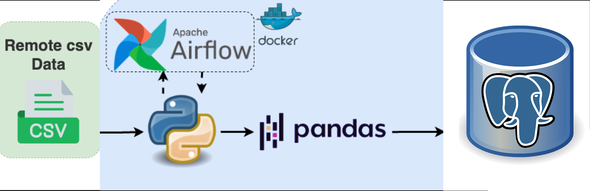
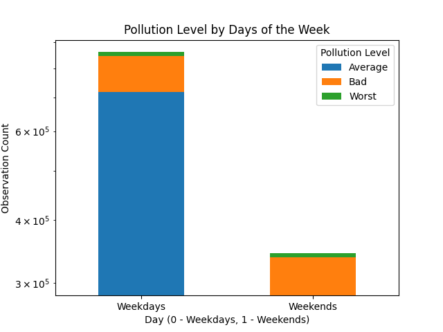
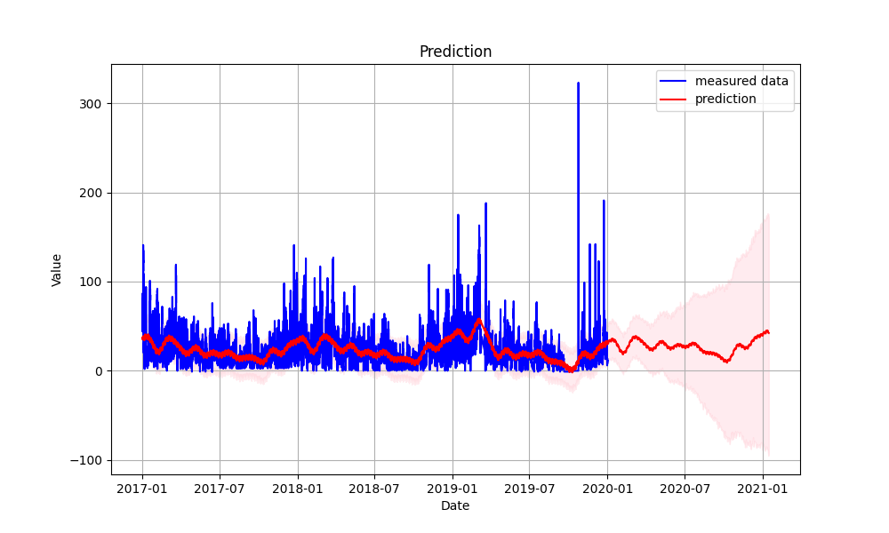
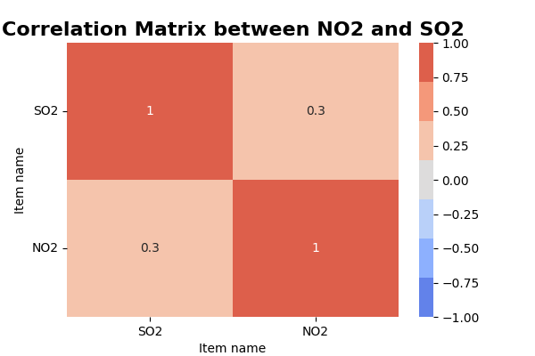
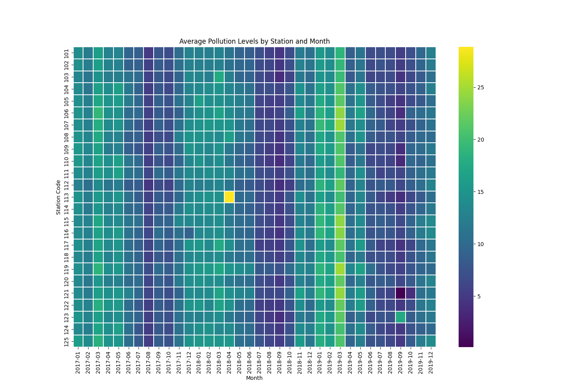

# DE_DS_BI
## This test project involves working with a SQL and ETL tool. The purpose is to import structured data from csv Dataset into a relational database (Postgres), perform specific SQL queries. This dataset is also analyzed and hypotheses tested, made predictions, etc.
--------
## The schema of Architecture
<p align="center">
  
</p>

## Dataset

The dataset consists of 4 csv files.
* [Measurement_info](dataset/Measurement_info.csv)
* [Measurement_item_info](dataset/Measurement_item_info.csv)
* [Measurement_station_info](dataset/Measurement_station_info.csv)
* [Measurement_summary](dataset/Measurement_summary.csv)
--------

## Technologies:
1. Python
2. PostgreSQL by Docker container
3. Apache Airflow as ETL tool
--------

## DE part

Task 1: PostgreSQL DBMS deployed with Apache Airflow in [docker-compose.yml](docker-compose.yaml)
  ```sh
  # Initialize the database
  docker compose up airflow-init
  # Running Airflow
  docker compose up -d
  ```
<p align="center">
  
</p>

Task 2: Create ETL Pipeline to PostgreSQL. Import csv files by Airflow

Before implementing our pipeline, we need to create tables in Postgres. DDL and DML SQL scripts are located in the dags folder.
<p align="center">
  
</p>

[etl_csv_postgres](dags/etl_csv_postgres.py) is the script which implements the ETL pipeline.

<p align="center">
  
</p>

* migrate_data

This Airflow DAG (migrate_data) migrates data from CSV files to corresponding tables in a PostgreSQL database. It consists of PythonOperator tasks that iterate over CSV files and load chunks of data into tables. The tasks are executed sequentially, with each task depending on the completion of the previous one, ensuring a step-by-step migration process.

<p align="center">
  
</p>

Task 3: SQL Queries

All queries are located in the dags folder. Each query corresponds to its own file.

* query1.sql

* query2.sql

* query3.sql

Task 4: Inserting query by Airflow implementation

[etl_queries_to_postgres](dags/etl_queries_to_postgres.py) is the script which implements inserting queries by Airflow

* etl_queries

This Airflow DAG named etl_queries is designed to perform ETL operations using SQL queries on a PostgreSQL database.
<p align="center">
  
</p>
<p align="center">
  
</p>

## DS_BI Part

Task 1:

Testing hypotheses
<p align="center">
  
</p>

Tested if air pollution is lower on weekdays compared to weekends. Results showed pollution levels do not significantly differ between these periods, visualized in a bar chart.

Weekend - 343453

Weekdays - 861465

Task 2:

Predictive modeling:
<p align="center">
  
</p>

Using the Prophet model, predicted gas concentrations based on seasonal patterns. The model effectively forecasts future concentrations, shown in a plot with actual and predicted values.

Task 3:

Correlation analysis:
<p align="center">
  
</p>

Analyzed the relationship between SO2 and NO2 concentrations using Spearman's correlation. The results indicated a significant correlation, visualized in a heatmap.

Correlation Coefficient (SO2 vs NO2): 0.29570311436520386

Task 4:

Free analysis
<p align="center">
  
</p>

Group data by stations and months, compute average pollution levels
